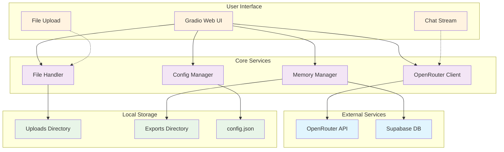
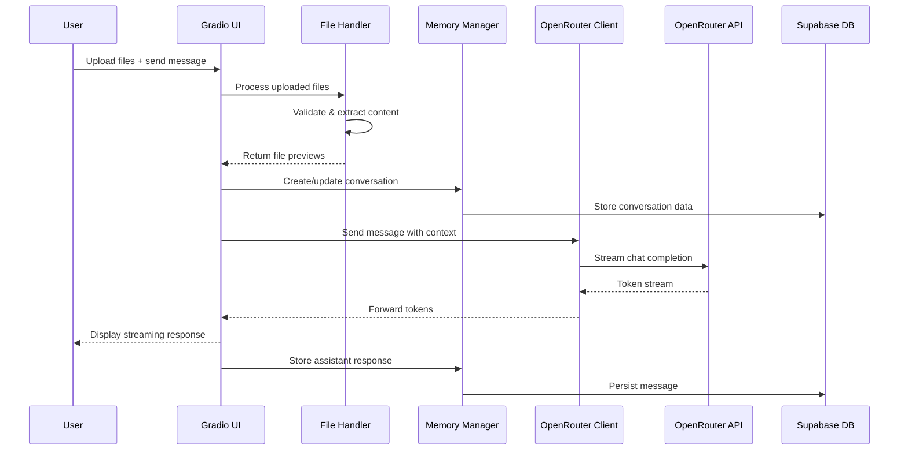
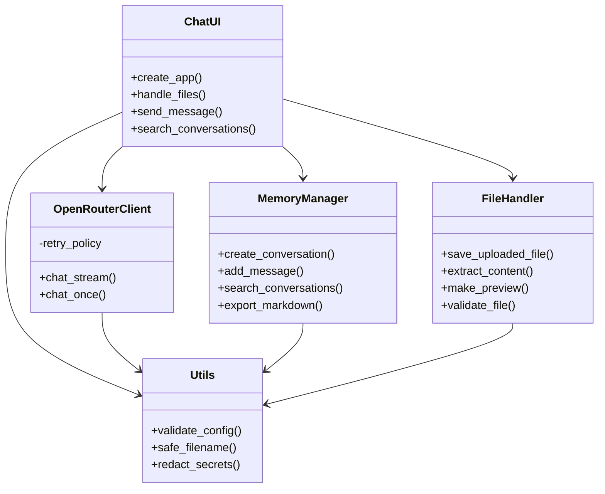
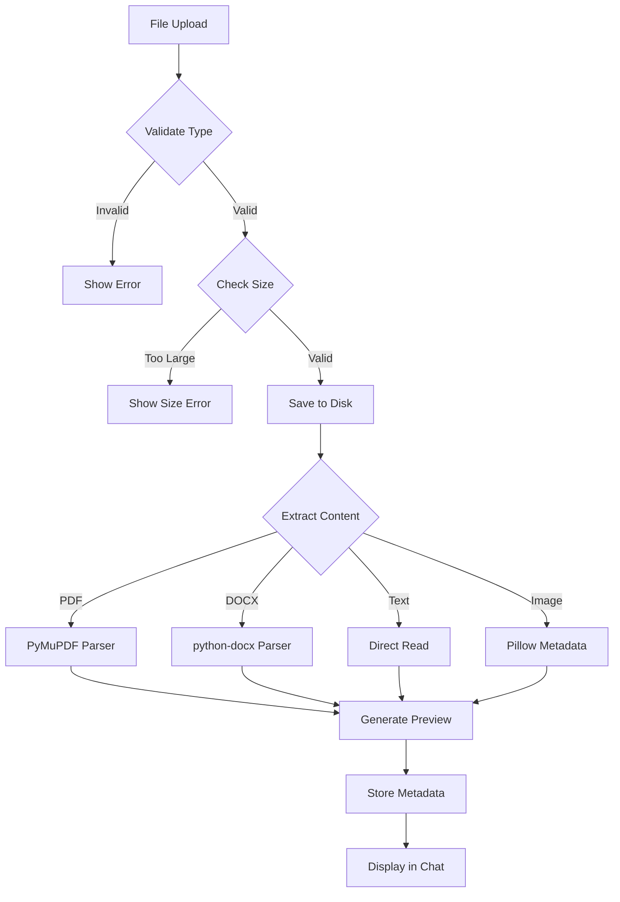

# Personal Chatbot with Persistent Memory

> 🤖 A local-first AI assistant with persistent memory, file processing, and streaming conversations

[](https://www.python.org/downloads/)
[](LICENSE)
[](Dockerfile)
[](https://gradio.app/)

## 🎯 Overview

Personal Chatbot is a sophisticated local-first AI assistant that combines the power of modern language models with persistent memory and intelligent file processing. Built for personal use, it offers a seamless chat experience with streaming responses, drag-and-drop file uploads, and comprehensive conversation management.

### ✨ Key Features

- **🚀 Streaming Chat Interface** - Real-time token streaming with multiple model support
- **📁 Intelligent File Processing** - Drag-and-drop support for 15+ file formats including PDF, DOCX, images
- **💾 Persistent Memory** - Conversation history with Supabase backend
- **🔍 Smart Search** - Find conversations by content, title, or attached files
- **📤 Export Capabilities** - Export conversations to Markdown with metadata
- **🎨 Modern UI** - Clean Gradio interface with dark/light themes
- **🔐 Security First** - Local file storage, secret masking, and safe parsing

### 🛠 Technology Stack


## 🏗 Architecture Overview



## 🔄 Core Workflow



## 📂 Project Structure

```
personal_chatbot/
├── 📄 main.py                     # Application entry point
├── 📄 requirements.txt            # Python dependencies
├── 📄 config.json                 # Local configuration (user-created)
├── 📁 src/                        # Core application modules
│   ├── 📄 chat_ui.py              # Gradio interface orchestration
│   ├── 📄 openrouter_client.py    # OpenRouter API client
│   ├── 📄 memory_manager.py       # Supabase integration
│   ├── 📄 file_handler.py         # File processing & validation
│   └── 📄 utils.py                # Shared utilities
├── 📁 uploads/                    # Local file storage (runtime)
├── 📁 exports/                    # Conversation exports (runtime)
├── 📁 setup/                      # Installation & database setup
│   ├── 📄 create_tables.sql       # Supabase schema
│   └── 📄 install.py              # Setup bootstrap script
├── 📁 tests/                      # Unit & integration tests
├── 📁 docs/                       # Comprehensive documentation
├── 📁 scripts/                    # Operational scripts
└── 📄 Dockerfile                  # Container configuration
```

## 🚀 Quick Start

### Prerequisites

- **Python 3.10+**
- **Supabase account** (free tier sufficient)
- **OpenRouter API key**

### Installation

1. **Clone the repository**
   ```bash
   git clone https://github.com/JackSmack1971/personal_chatbot.git
   cd personal_chatbot
   ```

2. **Set up Python environment**
   ```bash
   python -m venv .venv
   # Windows
   .venv\Scripts\activate
   # Linux/Mac
   source .venv/bin/activate
   ```

3. **Install dependencies**
   ```bash
   pip install -r personal_chatbot/requirements.txt
   ```

4. **Set up Supabase database**
   ```bash
   # Create a new Supabase project at https://supabase.com
   # Run the SQL from setup/create_tables.sql in your Supabase SQL editor
   ```

5. **Configure the application**
   ```bash
   python personal_chatbot/setup/install.py
   # This creates runtime directories and .env.example
   
   # Copy and edit configuration
   cp personal_chatbot/.env.example personal_chatbot/.env
   # Edit .env with your API keys
   ```

6. **Create config.json**
   ```json
   {
     "openrouter_api_key": "your_openrouter_api_key_here",
     "supabase_url": "https://your-project.supabase.co",
     "supabase_key": "your_supabase_anon_key_here",
     "default_model": "openrouter/horizon-beta",
     "max_file_size": 50,
     "theme": "dark"
   }
   ```

7. **Launch the application**
   ```bash
   python personal_chatbot/main.py
   ```

The application will start and open in your default browser at `http://localhost:7860`.

## 💻 Usage

### Basic Chat
1. Type your message in the text input
2. Press Enter or click "Send"
3. Watch the AI response stream in real-time

### File Upload
1. Drag and drop files anywhere in the chat area, or
2. Click the file upload button
3. Supported formats: `.txt`, `.md`, `.pdf`, `.docx`, `.xlsx`, `.py`, `.js`, `.json`, `.yaml`, `.csv`, `.html`, `.css`, `.sql`, `.xml`, `.png`, `.jpg`, `.jpeg`, `.gif`, `.webp`
4. Files are automatically processed and previewed

### Model Selection
Choose from multiple AI models:
- **OpenRouter Horizon Beta** (default)
- **Anthropic Claude 3.5 Sonnet**
- **OpenAI GPT-4**

### Search & History
- Use the search box to find conversations by title, content, or filename
- Click any conversation to load it
- Recent conversations are automatically sorted by activity

### Export Conversations
Click "Export Conversation" to save the current chat as a Markdown file with:
- Conversation metadata
- Full transcript with timestamps
- List of referenced files

## 🐳 Docker Deployment

### Using Docker Compose (Recommended)

1. **Build and run**
   ```bash
   docker compose build
   docker compose up -d
   ```

2. **View logs**
   ```bash
   docker compose logs -f personal_chatbot
   ```

3. **Check health**
   ```bash
   docker compose ps
   docker inspect --format '{{json .State.Health}}' $(docker compose ps -q personal_chatbot)
   ```

### Configuration
Set environment variables in `.env` file or docker-compose.yml:

```yaml
environment:
  - OPENROUTER_API_KEY=${OPENROUTER_API_KEY}
  - SUPABASE_URL=${SUPABASE_URL}
  - SUPABASE_ANON_KEY=${SUPABASE_ANON_KEY}
  - LOG_LEVEL=INFO
```

## 🧪 Development

### Running Tests
```bash
python -m pytest tests/ -v
```

### Code Structure



### File Processing Flow



### Environment Setup
```bash
# Development dependencies
pip install -r requirements-dev.txt

# Pre-commit hooks
pre-commit install

# Run formatting
black personal_chatbot/
isort personal_chatbot/

# Type checking
mypy personal_chatbot/
```

## 🔐 Security Features

- **Secret Management**: API keys masked in UI, never logged
- **File Validation**: Type and size checks before processing
- **Safe Parsing**: Uses trusted libraries with no code execution
- **Local Storage**: All files remain on your machine
- **HTTPS Only**: All external API calls use encryption
- **Non-root Execution**: Docker container runs as unprivileged user

## 📖 Documentation

<details>
<summary>📚 Comprehensive Documentation</summary>

- **[Architecture Guide](docs/architecture.md)** - System design and component relationships
- **[API Integration](docs/integration-interfaces.md)** - External service contracts
- **[Security Architecture](docs/security-architecture.md)** - Security model and threat analysis
- **[Deployment Guide](docs/deployment/README.md)** - Production deployment procedures
- **[User Scenarios](docs/user-scenarios.md)** - Detailed usage examples
- **[Development Guide](docs/pseudocode.md)** - Implementation specifications
- **[Troubleshooting](docs/deployment/troubleshooting.md)** - Common issues and solutions

</details>

## 🔧 Configuration

### config.json Reference
```json
{
  "openrouter_api_key": "sk-...",           // Required: OpenRouter API key
  "supabase_url": "https://...",            // Required: Supabase project URL
  "supabase_key": "eyJ...",                 // Required: Supabase anon key
  "default_model": "openrouter/horizon-beta", // Default AI model
  "max_file_size": 50,                      // Max file size in MB
  "theme": "dark"                           // UI theme: "dark" or "light"
}
```

### Environment Variables
```bash
# Optional environment variable overrides
OPENROUTER_API_KEY=your_key_here
OPENROUTER_BASE_URL=https://api.openrouter.ai
SUPABASE_URL=your_supabase_url
SUPABASE_ANON_KEY=your_anon_key
LOG_LEVEL=INFO
```

## 🚧 Roadmap

- [ ] **Vector Search Integration** - Semantic search across conversation history
- [ ] **Advanced File Processing** - Support for more formats and OCR
- [ ] **Conversation Tags** - Organize chats with custom tags
- [ ] **Global Export** - Bulk export of all conversations
- [ ] **Voice Input** - Speech-to-text integration
- [ ] **Desktop Notifications** - System alerts for responses
- [ ] **Plugin System** - Extensible architecture for custom features

## 🤝 Contributing

We welcome contributions! Please see our [Contributing Guidelines](CONTRIBUTING.md) for details.

### Development Workflow
1. Fork the repository
2. Create a feature branch (`git checkout -b feature/amazing-feature`)
3. Make your changes
4. Add tests for new functionality
5. Ensure all tests pass (`python -m pytest`)
6. Commit your changes (`git commit -m 'Add amazing feature'`)
7. Push to the branch (`git push origin feature/amazing-feature`)
8. Open a Pull Request

## 📄 License

This project is licensed under the MIT License - see the [LICENSE](LICENSE) file for details.

## 🙏 Acknowledgments

- **[OpenRouter](https://openrouter.ai/)** - AI model aggregation service
- **[Supabase](https://supabase.com/)** - Backend-as-a-Service platform
- **[Gradio](https://gradio.app/)** - Machine learning web app framework
- **Community contributors** - Thank you for your support and contributions

---

<div align="center">

**[🏠 Home](#personal-chatbot-with-persistent-memory)** | **[📖 Docs](docs/)** | **[🐛 Issues](../../issues)** | **[💡 Discussions](../../discussions)**

*Built with ❤️ for the AI community*

</div>

---

> **Last Updated**: January 2025  
> **Analysis Generated**: Using advanced codebase analysis and documentation extraction
